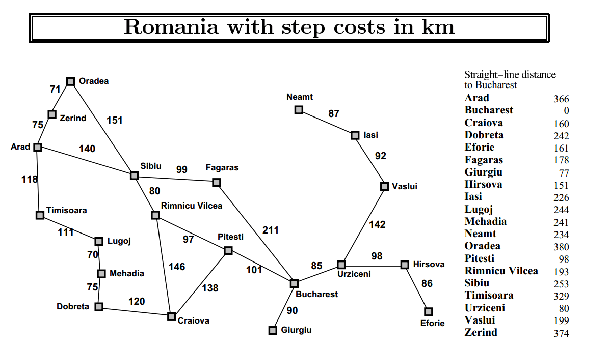

# A Star Algorithm

### Requirements
##### Python 3.*
##### All the cities distances and links are in the "cities.json" file.

### Description
##### Simple implementation of the A Star algorithm, that search for the smallest path to Bucharest.

### Reference Map

